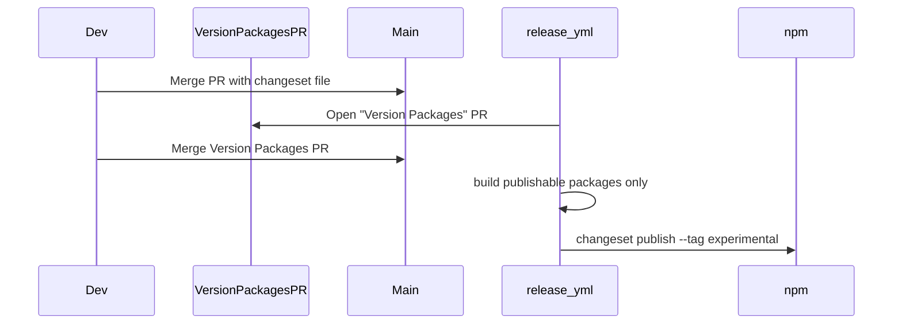

# Publishing @prisma-events packages

This guide covers how maintainers publish the npm packages in this monorepo.

## Published packages

| Package | Description |
|---------|-------------|
| `@prisma-events/dids-types` | Shared TypeScript types and constants |
| `@prisma-events/dids-schemas` | VC credential schemas and registry |
| `@prisma-events/dids-sdk` | Core SDK — DID lifecycle, VC issuance, Cardano anchoring |

All three packages are **version-linked** via Changesets: they always share the same version number. Publish order is handled automatically (`dids-types` → `dids-schemas` → `dids-sdk`).

The monorepo root (`prisma-dids`) stays private and is never published.

## Experimental pre-release mode

Packages are published under the **`experimental`** npm dist-tag only. There is **no stable `latest` release** yet.

| Dist-tag | Meaning |
|----------|---------|
| `experimental` | Pre-release builds; APIs may change |
| `latest` | Not used until a stable release is explicitly promoted |

Consumers must install explicitly:

```bash
pnpm add @prisma-events/dids-sdk@experimental
```

Pre-release versions use semver suffixes like `0.1.0-experimental.0`.

The repo is in Changesets pre mode (see [`.changeset/pre.json`](../.changeset/pre.json)). All publishes use:

```bash
changeset publish --tag experimental
```

### Promoting to stable (later)

When ready for an official release:

```bash
pnpm changeset pre exit
```

Then release a stable version and publish with the default `latest` tag (update the `release` script to drop `--tag experimental`).

## One-time setup

Before the first release can succeed:

1. **Create the npm org** `prisma-events` at [npmjs.com](https://www.npmjs.com) (scope: `@prisma-events`).
2. **Create an npm access token** with publish permission for `@prisma-events/*` packages.
3. **Add the GitHub secret** `NPM_TOKEN` to the repository settings (Settings → Secrets and variables → Actions).

## Release workflow

Releases are automated via [Changesets](https://github.com/changesets/changesets) and the [`.github/workflows/release.yml`](../.github/workflows/release.yml) workflow.



### Step 1 — Add a changeset

When your changes should trigger a new npm version:

```bash
pnpm changeset
```

Select the affected packages, choose the semver bump (patch / minor / major), and write a short summary. Commit the generated file in `.changeset/`.

### Step 2 — Merge to main

Push your branch and merge the PR. The release workflow detects pending changesets.

### Step 3 — Merge the Version Packages PR

The workflow opens a **Version Packages** PR that:

- Bumps package versions (with `-experimental.N` suffix while in pre mode)
- Updates `CHANGELOG.md` files
- Removes consumed changeset files

Review and merge this PR.

### Step 4 — Automatic publish

On merge, the workflow runs `pnpm release`, which builds only the three publishable packages (`dids-types`, `dids-schemas`, `dids-sdk`) and then runs `changeset publish --tag experimental`.

Verify:

```bash
pnpm view @prisma-events/dids-sdk@experimental
```

Confirm there is no `latest` tag yet:

```bash
pnpm view @prisma-events/dids-sdk dist-tags
```

## Local dry-run

Before your first publish, confirm tarballs include built output:

```bash
pnpm install
pnpm --filter @prisma-events/dids-types build
pnpm --filter @prisma-events/dids-schemas build
pnpm --filter @prisma-events/dids-sdk build
pnpm --filter @prisma-events/dids-types exec npm pack --dry-run
pnpm --filter @prisma-events/dids-schemas exec npm pack --dry-run
pnpm --filter @prisma-events/dids-sdk exec npm pack --dry-run
```

Each tarball should contain `dist/` and `README.md`, and should **not** include `*.test.*` files.

## Manual publish (emergency only)

If CI is unavailable, publish manually in dependency order with the experimental tag:

```bash
pnpm --filter @prisma-events/dids-types build
pnpm --filter @prisma-events/dids-schemas build
pnpm --filter @prisma-events/dids-sdk build
pnpm --filter @prisma-events/dids-types publish --access public --tag experimental --no-git-checks
pnpm --filter @prisma-events/dids-schemas publish --access public --tag experimental --no-git-checks
pnpm --filter @prisma-events/dids-sdk publish --access public --tag experimental --no-git-checks
```

Requires `npm login` or `NPM_TOKEN` in your environment.

## Consumer installation

External apps install the experimental SDK explicitly:

```bash
pnpm add @prisma-events/dids-sdk@experimental
# or
npm install @prisma-events/dids-sdk@experimental
```

Do **not** use `pnpm add @prisma-events/dids-sdk` without a tag until a stable `latest` release exists.

See [`packages/sdk/README.md`](../packages/sdk/README.md) for bundler configuration (Next.js / Vite).
